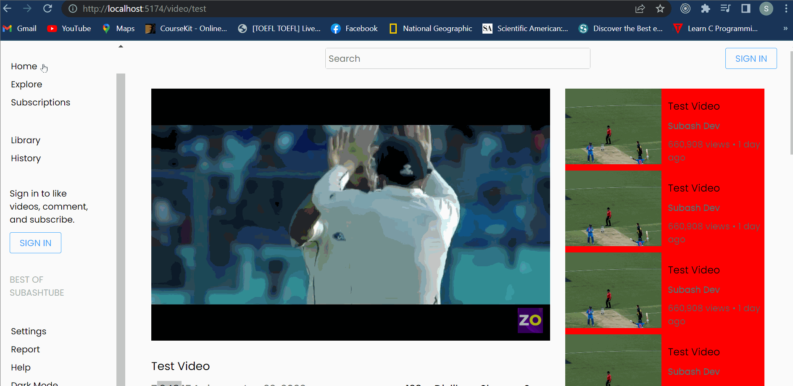

# VideoSharing-App-UI
The Video Sharing App is a web application developed using React and Styled Components. It provides users with the ability to upload videos, comment on videos, and switch between dark and light mode themes.

